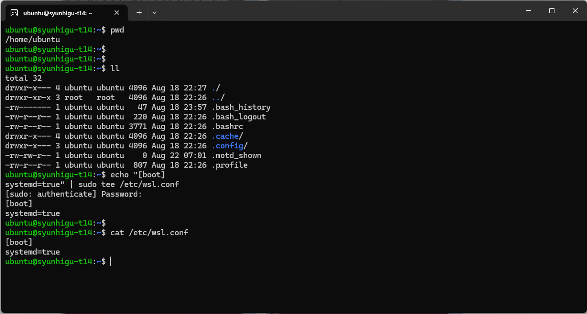
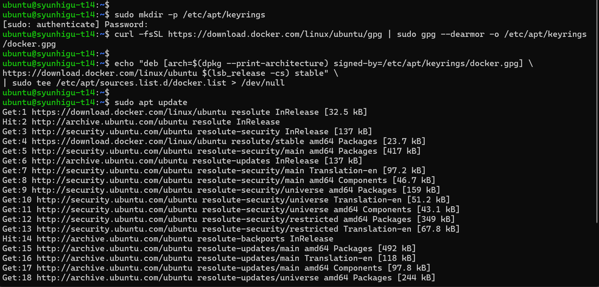
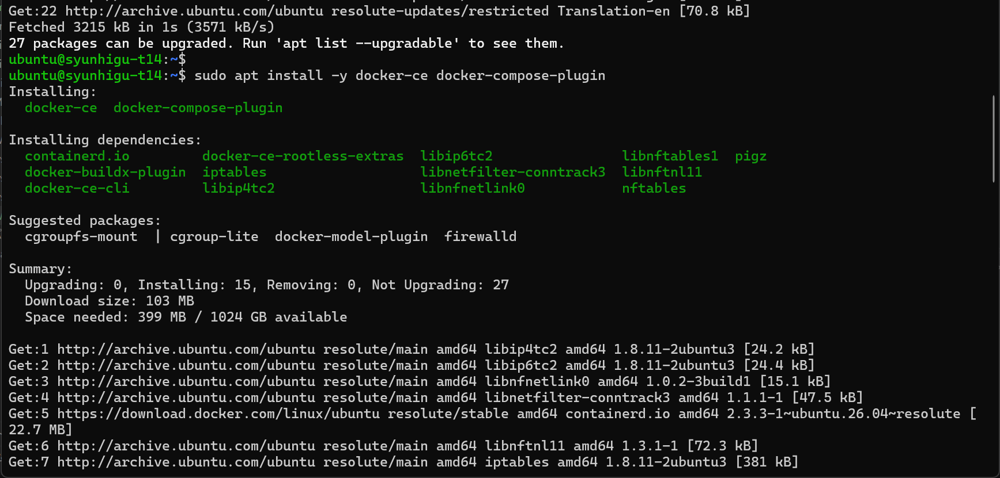
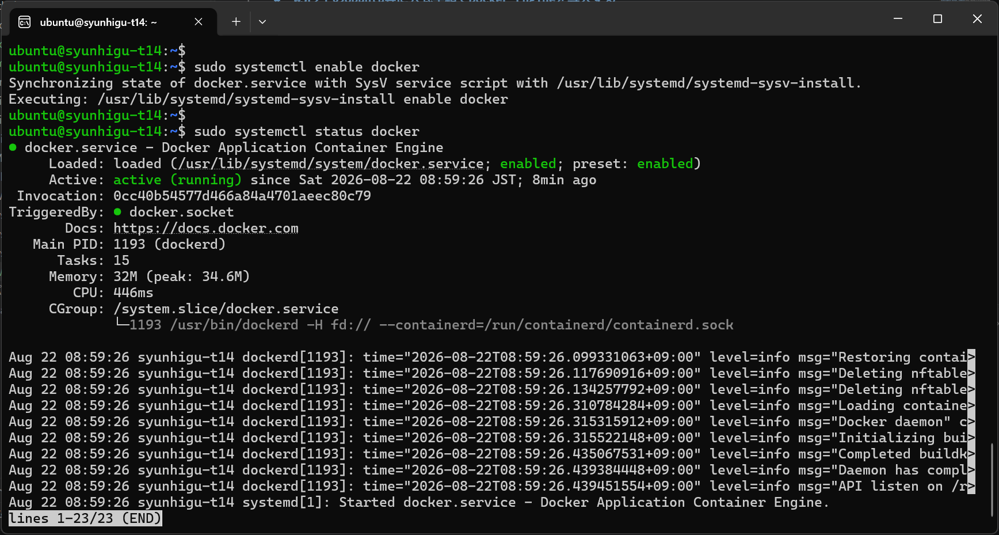
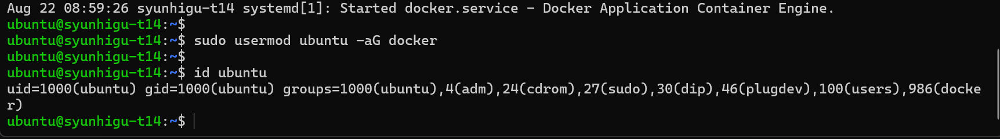
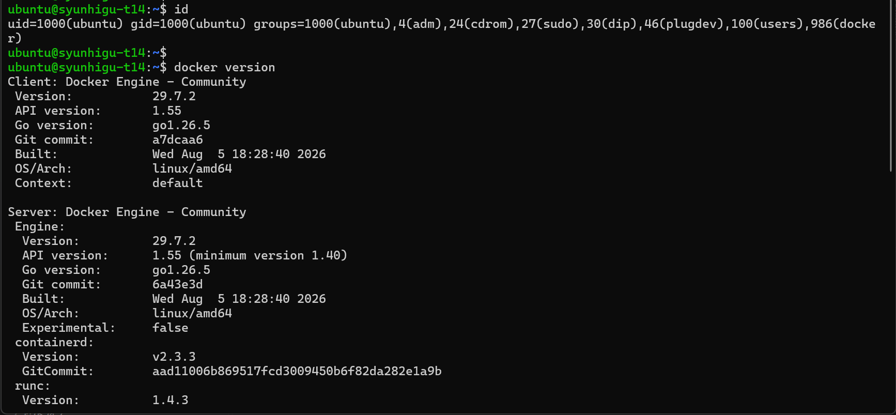
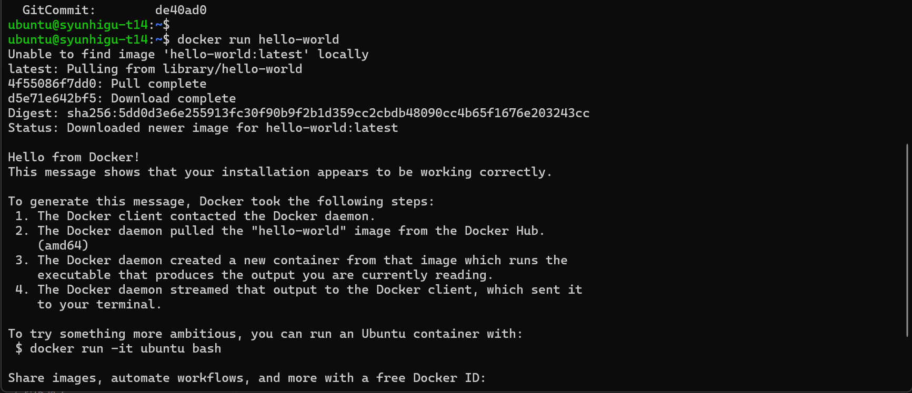
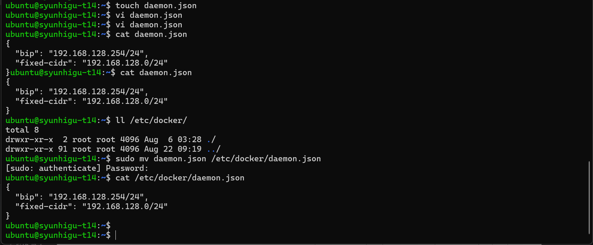

#  WSL2上のUbuntu等に公式手順でDocker Engineを導入する

## 前提条件
- WSL2にUbuntuインストール済み
- WindowsにVS Codeインストール済み

## 参考URL
- [公式](https://docs.docker.com/engine/install/ubuntu/)
- [Windows11でDocker Desktopを使わずにDocker](https://eng-blog.iij.ad.jp/archives/17746)

## 手順
1. systemdの有効化
    systemdを有効化する為、以下のコマンドで /etc/wsl.conf を作成
    ```
    echo "[boot]
    systemd=true" | sudo tee /etc/wsl.conf
    cat /etc/wsl.conf
    ```
      

    設定反映の為、WSLをシャットダウン及びUbuntu再起動
    - シャットダウン（PowerShell）
        ```
        wsl.exe --shutdown
        ```
    - Ubuntu再起動
2. Dockerのインストール
    公式の手順を参考にDockerをインストール  
    https://docs.docker.com/engine/install/ubuntu/  
    以下要約
    ```
    1. 
    sudo mkdir -p /etc/apt/keyrings
    curl -fsSL https://download.docker.com/linux/ubuntu/gpg | sudo gpg --dearmor -o /etc/apt/keyrings/docker.gpg

    2.
    echo "deb [arch=$(dpkg --print-architecture) signed-by=/etc/apt/keyrings/docker.gpg] \
    https://download.docker.com/linux/ubuntu $(lsb_release -cs) stable" \
    | sudo tee /etc/apt/sources.list.d/docker.list > /dev/null
    
    3.
    sudo apt update
    sudo apt install -y docker-ce docker-compose-plugin
    ```
    1,2,3  
      
    3  
    
3. Dockerを起動
    dockerをsystemdにサービス登録し、起動を確認  
    **自動で起動しているので、startは不要**
    ```
    sudo systemctl enable docker
    sudo systemctl status docker
    ```
    
4. dockerグループへの追加  
    自分のアカウントでdockerコマンドが使えるようにグループに追加する  
    以下の例ではを ubuntu をdockerグループに追加。自身のアカウントに変更して実行。
    ```
    sudo usermod ubuntu -aG docker
    id ubuntu
    ```
    
5. 動作確認  
    自分のアカウントのグループが反映されるよう、プルダウンメニューから再度Ubuntuを開く。  
    自分がdockerグループ所属になったことを確認して、いろいろコマンドを実行できたら終わり。
    ```
    コマンド確認
    id
    docker version
    コンテナ起動
    docker run hello-world
    ```
    コマンド確認  
    
    コンテナ起動  
    
## おまけ
1. Docker bridge networkのIPアドレス帯変更  
    Docker bridge network (docker0)が、WSLやLANのIPアドレス帯と重複する場合がある。  
    その場合、コンテナと重複したIPアドレス帯が通信できない為、docker0のIPアドレス帯を変更する。  
    (WSLとDockerはどちらも「172.16.0.0～172.31.255.255」を使うので地味に重複する)  
    「/etc/docker/daemon.json」(なければ新規作成する)を設定する事で、IPアドレス帯を変更できる。  
    以下が設定例。(この場合、192.168.128.0/24のネットワークとなり、192.168.128.254 がgw になる)
    ```json
    {
      "bip": "192.168.128.254/24",
      "fixed-cidr": "192.168.128.0/24"
    }
    ```
    ファイルを設置した後は「sudo service docker restart」でDockerを再起動する事で反映される。  
    1. ファイル作成及び配置  
        
    2. Dockerを再起動
        ```
        sudo service docker restart
        ```
2. コンテナ向けのproxy設定  
    Windowsのproxy設定はdockerコンテナに反映されない。  
    コンテナのENVにhttp_proxyを都度設定する方法もあるが、「~/.docker/config.json」に設定しておくと自動設定される。  
    以下が設定例。(proxy.your.domain:8080には使用しているのproxyサーバとportを設定する)
    ```json
    {
      "proxies": {
        "default": {
          "httpProxy": "http://proxy.your.domain:8080",
          "httpsProxy": "http://proxy.your.domain:8080"
        }
      }
    }
    ```