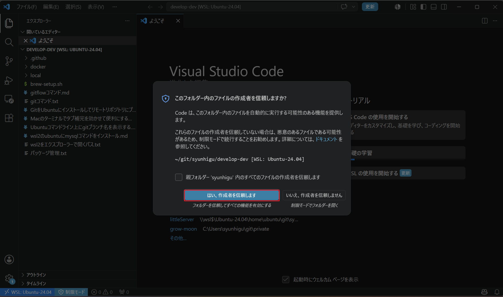
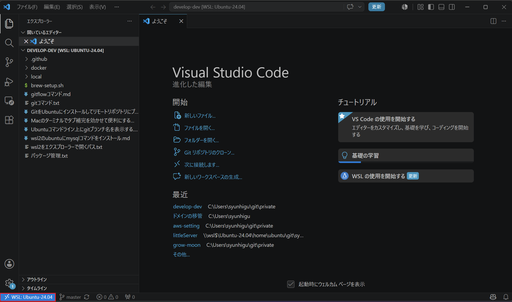

# WSL2のUbuntuとVsCode連携

## 前提条件
- WindowsにVS Codeインストール済み
- WSL2にUbuntuインストール済み
- Gitインストール及び設定済み・・・WSL2側（Windows側は必要に応じて）

## 1. VS Codeに拡張機能インストール
- Japanese Language Pack for VS Code
- Remote Development
- etc（お好み）

## 2. Linuxディストリビューションを更新
PowerShellでWSL2のUbuntu起動
```
wsl -d Ubuntu-24.04
```

Ubuntu更新
```
sudo apt-get update
```

## 3. WSL開発環境とVS Codeを連携
適当な作業ディレクトリに移動し、WSL開発環境とVS Codeを連携する
```
ubuntu@syunhigu-carbon:~ $
ubuntu@syunhigu-carbon:~ $ cd git/syunhigu/develop-dev/
ubuntu@syunhigu-carbon:~/git/syunhigu/develop-dev (master) $
ubuntu@syunhigu-carbon:~/git/syunhigu/develop-dev (master) $ pwd
/home/ubuntu/git/syunhigu/develop-dev
ubuntu@syunhigu-carbon:~/git/syunhigu/develop-dev (master) $
ubuntu@syunhigu-carbon:~/git/syunhigu/develop-dev (master) $ code .
Installing VS Code Server for Linux x64 (fcf604774b9f2674b473065736ee75077e256353)
Downloading: 100%
Unpacking: 100%
Unpacked 3554 files and folders to /home/ubuntu/.vscode-server/bin/fcf604774b9f2674b473065736ee75077e256353.
Looking for compatibility check script at /home/ubuntu/.vscode-server/bin/fcf604774b9f2674b473065736ee75077e256353/bin/helpers/check-requirements.sh
Running compatibility check script
Compatibility check successful (0)
ubuntu@syunhigu-carbon:~/git/syunhigu/develop-dev (master) $
```

確認を求められるので、はいをクリック  
  

VS Codeの左下にWSL: Ubuntu-24.04と表示されれば接続完了  

